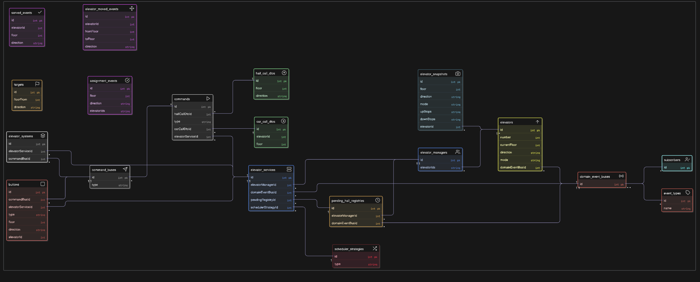

# Elevator System - Low Level Design

A comprehensive elevator system implementation using Java with command pattern, event-driven architecture, and multiple scheduling strategies.

## ER Diagram

[View Interactive ER Diagram](https://app.eraser.io/workspace/xD9jCdB8ZG5LSphhWETP)

The ER diagram shows the comprehensive data model for the elevator system, including:
- **Event Entities**: `served_events`, `elevator_moved_events`, `assignment_events`
- **DTOs**: `hall_call_dtos`, `car_call_dtos`, `elevator_snapshots`
- **Core Components**: `elevators`, `buttons`, `targets`, `commands`
- **System Management**: `elevator_systems`, `elevator_services`, `elevator_managers`
- **Infrastructure**: `command_buses`, `domain_event_buses`, `scheduler_strategies`

## Basic Functional Requirements (Pre-LLD)

### 1. Elevator Types
- Support conventional elevators where passengers press Up/Down buttons outside and select destination inside the cabin.

### 2. Multiple Elevators
- A building may have multiple elevators, and the system should decide which elevator serves a request.

### 3. Request Handling
- The system must accept multiple, parallel requests from different floors and passengers.

### 4. Scheduling Strategy
- The system should have a mechanism to select the most optimal elevator based on factors like current floor, direction, and load.

### 5. Grouping Requests
- Combine multiple requests in the same direction or nearby floors to reduce waiting and travel time.

### 6. Button and Indicator States
- Buttons light up when pressed and reset when served.
- Displays should show floor number and direction of each elevator.

### 7. Emergency & Safety Features
- Must support emergency stop, overload detection, door obstruction handling, and fire recall mode.

## Architecture Overview

This implementation follows several design patterns and principles:

- **Command Pattern**: For handling elevator and hall call commands
- **Event-Driven Architecture**: Using domain events for system communication
- **Strategy Pattern**: Multiple scheduling strategies (Broadcast, Exclusive ETA, Scheduler)
- **Observer Pattern**: For panel updates and notifications
- **Factory Pattern**: For creating elevators, services, and strategies

## Key Components

- **Elevator**: Core entity representing individual elevators
- **ElevatorManager**: Manages multiple elevators and request distribution
- **Scheduling Strategies**: Different algorithms for elevator assignment
- **Command Bus**: Asynchronous command processing
- **Event Bus**: Domain event handling and notifications
- **Button System**: Hall and cabin button management

## Getting Started

1. Compile the Java source files
2. Run the `Main.java` class to start the elevator system
3. The system supports multiple elevators with configurable scheduling strategies

## Design Patterns Used

- Command Pattern
- Strategy Pattern
- Observer Pattern
- Factory Pattern
- Event-Driven Architecture
