# Class Diagram - Parking Lot Management System

## Detailed Class Diagram with Methods

```mermaid
classDiagram
    %% Core Entities
    class ParkingLot {
        -String name
        -List~EntrancePanel~ entrances
        -List~ExitPanel~ exits
        -DisplayBoard displayBoard
        -Map~ParkingSpotEnum, List~ParkingSpot~~ freeParkingSpots
        -Map~ParkingSpotEnum, List~ParkingSpot~~ occupiedParkingSpots
        -static volatile ParkingLot parkingLot
        -static Object lock
        +getInstance() ParkingLot
        +getName() String
        +setName(String) void
        +getEntrances() List~EntrancePanel~
        +setEntrances(List~EntrancePanel~) void
        +getExits() List~ExitPanel~
        +setExits(List~ExitPanel~) void
        +getDisplayBoard() DisplayBoard
        +setDisplayBoard(DisplayBoard) void
        +getFreeParkingSpots() Map~ParkingSpotEnum, List~ParkingSpot~~
        +setFreeParkingSpots(Map) void
        +getOccupiedParkingSpots() Map~ParkingSpotEnum, List~ParkingSpot~~
        +setOccupiedParkingSpots(Map) void
    }

    class DisplayBoard {
        -static volatile DisplayBoard displayBoard
        -static Object lock
        -Map~ParkingSpotEnum, AtomicInteger~ freeParkingSpots
        +getInstance() DisplayBoard
        +getFreeParkingSpots() Map~ParkingSpotEnum, Integer~
        +updateFreeSpots(ParkingSpotEnum, int) void
        +getFreeSpotsCount(ParkingSpotEnum) int
    }

    %% Vehicle Hierarchy
    class Vehicle {
        -static AtomicInteger x
        -int id
        -ParkingSpotEnum parkingSpotEnum
        +Vehicle(ParkingSpotEnum)
        +getId() int
        +setId(int) void
        +getParkingSpotEnum() ParkingSpotEnum
        +setParkingSpotEnum(ParkingSpotEnum) void
    }

    class Car {
        +Car()
    }

    class Truck {
        +Truck()
    }

    class Motorbike {
        +Motorbike()
    }

    %% Parking Spot Hierarchy
    class ParkingSpot {
        -static AtomicInteger x
        -int id
        -ParkingSpotState state
        -int floor
        -int amount
        +ParkingSpot(int, int)
        +getId() int
        +setId(int) void
        +isFree() boolean
        +setFree(boolean) void
        +getState() ParkingSpotState
        +setState(ParkingSpotState) void
        +getFloor() int
        +setFloor(int) void
        +getAmount() int
        +setAmount(int) void
        +cost(int) int*
    }

    class Mini {
        +Mini(int, int)
        +cost(int) int
    }

    class Compact {
        +Compact(int, int)
        +cost(int) int
    }

    class Large {
        +Large(int, int)
        +cost(int) int
    }

    %% State Pattern
    class ParkingSpotState {
        +parkVehicle(Vehicle) void*
        +freeSpot() void*
        +isAvailable() boolean*
        +getStateName() String*
    }

    class FreeState {
        +parkVehicle(Vehicle) void
        +freeSpot() void
        +isAvailable() boolean
        +getStateName() String
    }

    class OccupiedState {
        +parkVehicle(Vehicle) void
        +freeSpot() void
        +isAvailable() boolean
        +getStateName() String
    }

    %% Decorator Pattern
    class SpotDecorator {
        #ParkingSpot parkingSpot
        +SpotDecorator(ParkingSpot)
    }

    class Electric {
        +Electric(ParkingSpot)
        +cost(int) int
    }

    class Wash {
        +Wash(ParkingSpot)
        +cost(int) int
    }

    %% Strategy Pattern
    class Strategy {
        +findParkingSpot(ParkingSpotEnum) ParkingSpot*
    }

    class NearestFirstParkingStrategy {
        +findParkingSpot(ParkingSpotEnum) ParkingSpot
    }

    class FarthestFirstParkingStrategy {
        +findParkingSpot(ParkingSpotEnum) ParkingSpot
    }

    %% Services
    class ParkingService {
        +entry(Vehicle) ParkingTicket*
        +exit(ParkingTicket, Vehicle) int*
    }

    class ParkingServiceImpl {
        -Strategy parkingStrategy
        -ParkingLot parkingLot
        -DisplayService displayService
        -ParkingSpotRepository repository
        -List~Observer~ observers
        +ParkingServiceImpl(Strategy, DisplayService, ParkingSpotRepository)
        +entry(Vehicle) ParkingTicket
        +exit(ParkingTicket, Vehicle) int
        +addObserver(Observer) void
        +notifyAllObservers(ParkingEvent) void
        +addWash(ParkingTicket) void
    }

    class PaymentService {
        +acceptCash(int) void*
        +acceptCreditCard(String, int, int) void*
    }

    class PaymentServiceImpl {
        +acceptCash(int) void
        +acceptCreditCard(String, int, int) void
    }

    class DisplayService {
        +update(ParkingSpotEnum, int) void*
    }

    class DisplayServiceImpl {
        +update(ParkingEvent) void
        +update(ParkingSpotEnum, int) void
    }

    %% Repository Pattern
    class ParkingSpotRepository {
        +findFreeSpotsByType(ParkingSpotEnum) List~ParkingSpot~*
        +findOccupiedSpotsByType(ParkingSpotEnum) List~ParkingSpot~*
        +findById(int) Optional~ParkingSpot~*
        +save(ParkingSpot) void*
        +remove(ParkingSpot) void*
        +moveToFree(ParkingSpot) void*
        +moveToOccupied(ParkingSpot) void*
    }

    class ParkingSpotRepositoryImpl {
        -ParkingLot parkingLot
        +ParkingSpotRepositoryImpl()
        +findFreeSpotsByType(ParkingSpotEnum) List~ParkingSpot~
        +findOccupiedSpotsByType(ParkingSpotEnum) List~ParkingSpot~
        +findById(int) Optional~ParkingSpot~
        +save(ParkingSpot) void
        +remove(ParkingSpot) void
        +moveToFree(ParkingSpot) void
        +moveToOccupied(ParkingSpot) void
    }

    %% Command Pattern
    class Command {
        +execute() void*
        +undo() void*
    }

    class ParkVehicleCommand {
        -Vehicle vehicle
        -ParkingSpot parkingSpot
        -ParkingSpotRepository repository
        -ParkingTicket ticket
        -boolean executed
        +ParkVehicleCommand(Vehicle, ParkingSpot, ParkingSpotRepository)
        +execute() void
        +undo() void
        +getTicket() ParkingTicket
    }

    %% Observer Pattern
    class Observer {
        +update(ParkingEvent) void*
    }

    class ParkingEvent {
        -ParkingEventType eventType
        -ParkingSpotEnum parkingSpotEnum
        +ParkingEvent(ParkingEventType, ParkingSpotEnum)
        +getEventType() ParkingEventType
        +getParkingSpotEnum() ParkingSpotEnum
    }

    %% Builder Pattern
    class ParkingLotBuilder {
        -String name
        -List~EntrancePanel~ entrances
        -List~ExitPanel~ exits
        -int miniSpots
        -int compactSpots
        -int largeSpots
        +setName(String) ParkingLotBuilder
        +addEntrance(EntrancePanel) ParkingLotBuilder
        +addExit(ExitPanel) ParkingLotBuilder
        +withMiniSpots(int) ParkingLotBuilder
        +withCompactSpots(int) ParkingLotBuilder
        +withLargeSpots(int) ParkingLotBuilder
        +build() ParkingLot
    }

    %% Validation
    class ParkingValidator {
        +validateVehicle(Vehicle) void
        +validateTicket(ParkingTicket) void
        +validateAmount(int) void
    }

    %% DTOs
    class ParkingTicket {
        -static AtomicInteger x
        -int id
        -Vehicle vehicle
        -ParkingSpot parkingSpot
        -LocalDateTime timestamp
        +ParkingTicket(Vehicle, ParkingSpot)
        +getId() int
        +getVehicle() Vehicle
        +getParkingSpot() ParkingSpot
        +getTimestamp() LocalDateTime
        +getParkingHours() int
    }

    class Account {
        -String name
        -String email
        -String password
    }

    class Admin {
        +Admin()
    }

    class ParkingAttendant {
        +ParkingAttendant()
    }

    %% Enums
    class ParkingSpotEnum {
        <<enumeration>>
        MINI
        COMPACT
        LARGE
    }

    class ParkingEventType {
        <<enumeration>>
        ENTRY
        EXIT
    }

    %% Relationships
    Vehicle <|-- Car
    Vehicle <|-- Truck
    Vehicle <|-- Motorbike
    
    ParkingSpot <|-- Mini
    ParkingSpot <|-- Compact
    ParkingSpot <|-- Large
    
    ParkingSpotState <|-- FreeState
    ParkingSpotState <|-- OccupiedState
    
    SpotDecorator <|-- Electric
    SpotDecorator <|-- Wash
    
    Strategy <|-- NearestFirstParkingStrategy
    Strategy <|-- FarthestFirstParkingStrategy
    
    ParkingService <|-- ParkingServiceImpl
    PaymentService <|-- PaymentServiceImpl
    DisplayService <|-- DisplayServiceImpl
    ParkingSpotRepository <|-- ParkingSpotRepositoryImpl
    
    Command <|-- ParkVehicleCommand
    
    Account <|-- Admin
    Account <|-- ParkingAttendant
    
    ParkingLot --> DisplayBoard : contains
    ParkingLot --> ParkingSpot : manages
    ParkingLot --> Vehicle : tracks
    
    ParkingSpot --> ParkingSpotState : has
    ParkingSpot --> SpotDecorator : decorated by
    
    ParkingServiceImpl --> Strategy : uses
    ParkingServiceImpl --> ParkingSpotRepository : uses
    ParkingServiceImpl --> DisplayService : uses
    ParkingServiceImpl --> Observer : notifies
    
    ParkVehicleCommand --> Vehicle : operates on
    ParkVehicleCommand --> ParkingSpot : operates on
    ParkVehicleCommand --> ParkingSpotRepository : uses
    
    ParkingTicket --> Vehicle : references
    ParkingTicket --> ParkingSpot : references
    
    DisplayServiceImpl --> Observer : implements
    DisplayServiceImpl --> DisplayBoard : updates
```

## Key Design Decisions

### 1. Thread Safety
- Used `volatile` keyword for singleton instances
- Implemented double-checked locking pattern
- Used thread-safe collections (`ConcurrentHashMap`, `CopyOnWriteArrayList`)
- Used `AtomicInteger` for counters

### 2. SOLID Principles
- **SRP**: Each class has a single responsibility
- **OCP**: Strategy pattern allows extension without modification
- **LSP**: Proper inheritance hierarchy maintained
- **ISP**: Specific interfaces for different services
- **DIP**: Dependency injection for loose coupling

### 3. Design Patterns
- **Singleton**: For system-wide objects (ParkingLot, DisplayBoard)
- **Strategy**: For different parking algorithms
- **Decorator**: For adding features to parking spots
- **Observer**: For real-time display updates
- **State**: For managing parking spot states
- **Repository**: For data access abstraction
- **Command**: For encapsulating operations
- **Builder**: For complex object creation

### 4. Concurrency Handling
- Synchronized critical sections
- Thread-safe data structures
- Proper locking mechanisms
- Atomic operations for counters
